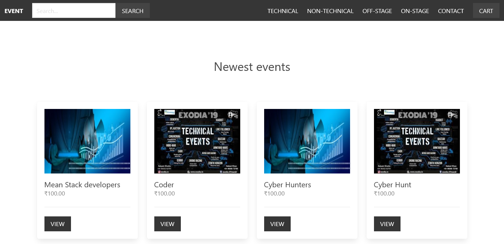
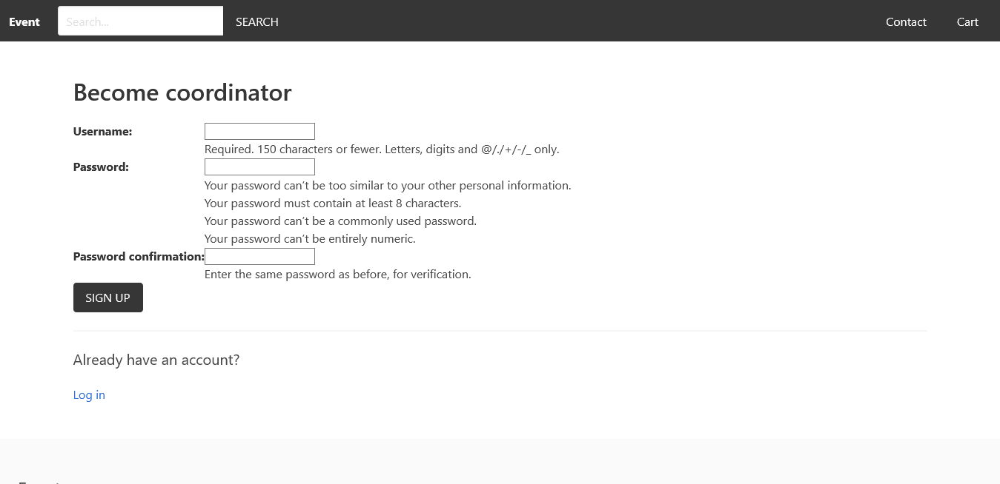
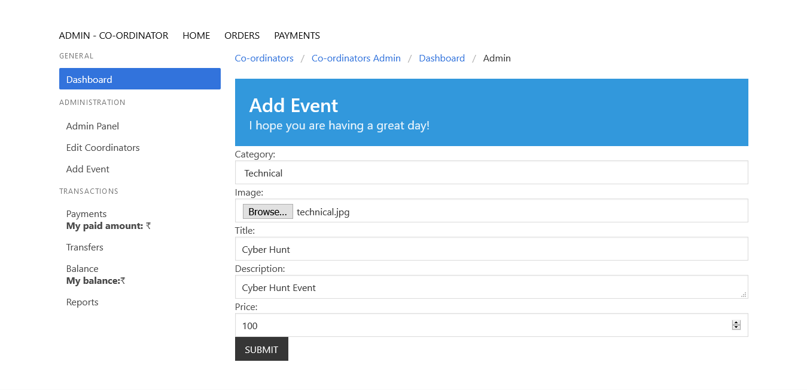
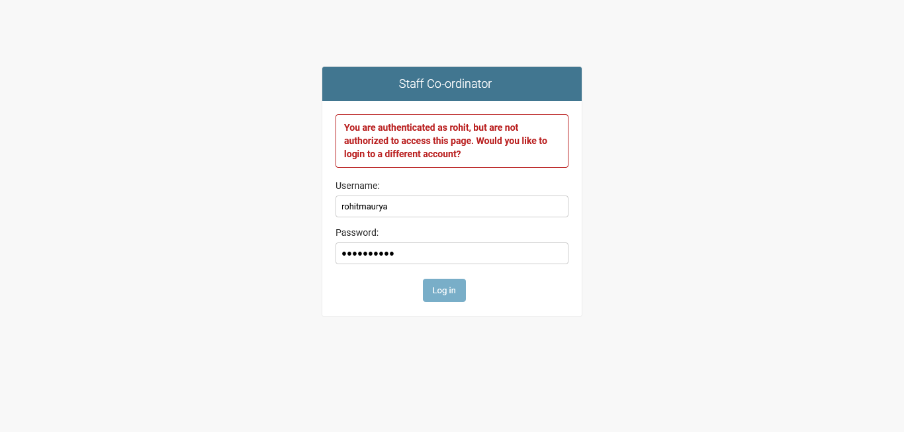
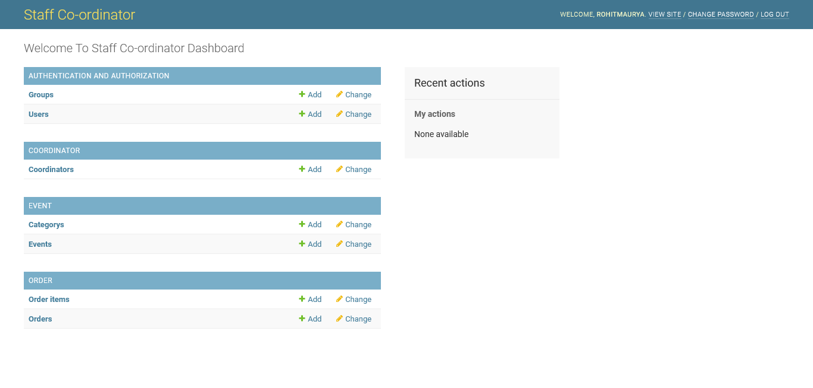
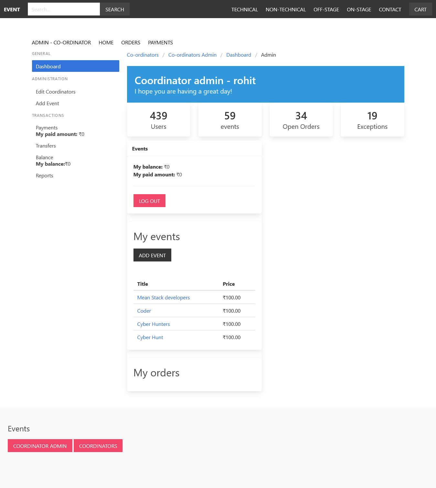

# EventManager
This website was made while learing django framework. 

A event Management website in python + Django with bulma css framework

Dependency
Django-```pip install django```
Django is a high-level Python Web framework

Stripe-```pip install stripe```
Stripe - A complete payments platform

Pillow-```pip install pillow```
Pillow is a Python Imaging Library
(dose not support png if used will throw a os error)

To Run this Project use the following command


1.```python -m venv env```
creates virtual enviroment

2.```python manage.py makemigrations```
generates the SQL commands for preinstalled app

3.```python manage.py migrate```
migrate executes those SQL commands in the database file

3.```Python manage.py migrate --run-syncdb```
reconstruct database schema according to altered model fields(not necessary)

4.```python manage.py createsuperuser```
It will create an admin superuser with all Administrative privileges

5.```python manage.py runserver```
runs the server on localhost.
127.0.0.1:8000


Home page


become Co-ordinator- can manage his events/orders/view other co-ordinators



Add event page


Superuserlogin 
url= 127.0.0.1:8000/admin


Superuser admin panel(django-admin)


Co-ordinator Admin Panel

